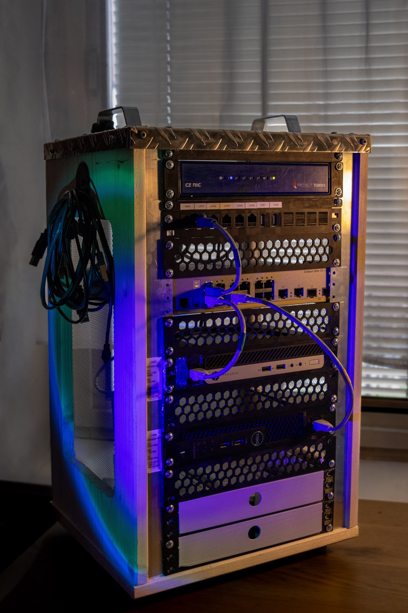

# HOM3L4B

Personal homelab for self-hosting, networking experiments, and learning.

## Hardware

| 		Device	       	   |  Role  |        CPU         | RAM  |
|----------------------------------|--------|--------------------|------|
| Turris 1.x                       | Router | Freescale P2020    |  2GB |
| Cisco Catalyst WS-C3560CX-12PC-S | Switch |          -         |   -  |
| HP ProDesk 405 G4 Mini           | node01 | Ryzen 5 PRO 2400GE | 16GB |
| Dell OptiPlex 3070               | node02 | i5-9500T           | 16GB |

## Network

- Router: TurrisOS 9.0.4
- VLANs: 10 Servers, 20 WiFi-Clients, 30 IoT, 99 Management
- Remote access: Tailscale (node01 subnet router)

## Nodes

|  Node  |      IP      |                Services                |
|--------|--------------|----------------------------------------|
| node01 | 192.168.10.2 | Nextcloud, Jellyfin, AdGuard (planned) |
| node02 | 192.168.10.3 | Monitoring, Git, Experiments           |

## Documentation

- [Hardware](hardware/)
- [Network](network/)
- [Services](services/)
- [Runbooks](runbooks/)
